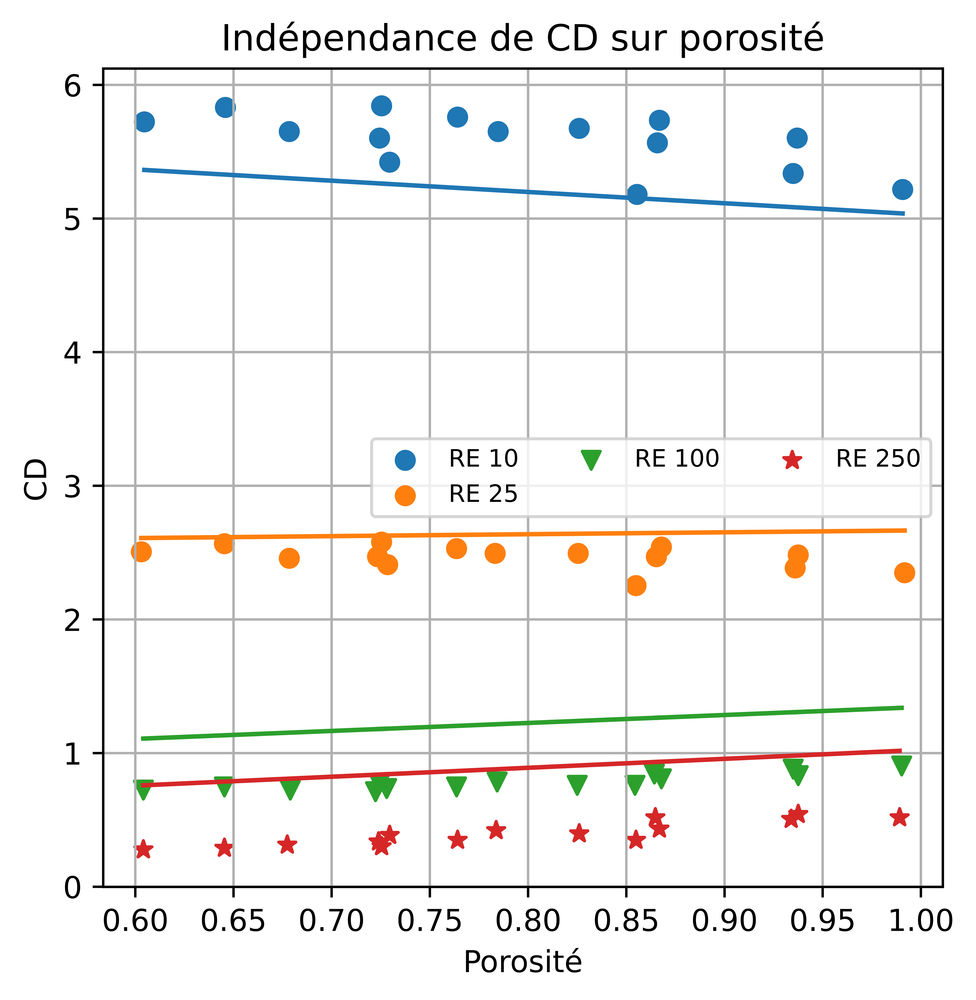
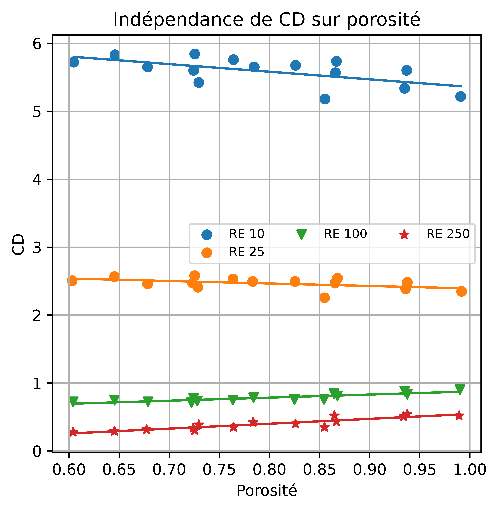

# 📊 Drag Coefficient Modeling — Python Data Analysis & Optimization

Python-based analytical project developed to explore the relationship between porosity and drag coefficient (CD) under different Reynolds number conditions and to optimize the parameters of a mathematical model using experimental data.

## 🔎 Project Overview

This project applies Python to analyze experimental engineering data and evaluate the behavior of the drag coefficient (CD) as porosity changes under different Reynolds numbers.

Experimental data were imported from Excel and analyzed for four Reynolds number conditions: **Re = 10, 25, 100, and 250**.

A mathematical model was then evaluated and its parameters optimized by minimizing the sum of squared residuals between model predictions and experimental observations.

## 🎯 Analytical Objectives

The analysis was designed to:

- Import and structure experimental data from Excel
- Explore the relationship between porosity and drag coefficient
- Compare behavior across different Reynolds numbers
- Implement a mathematical model in Python
- Calculate residuals between observed and modeled values
- Optimize model parameters by minimizing the sum of squared errors
- Visualize experimental observations and model results

## 🛠️ Tools & Libraries

- **Python** — Analytical programming
- **Pandas** — Excel data import and data manipulation
- **NumPy** — Numerical operations and residual calculations
- **Matplotlib** — Data visualization
- **SciPy** — Numerical optimization using `scipy.optimize.minimize`
- **Excel** — Experimental data source

## 📐 Methodology

The dataset contains porosity and drag coefficient measurements corresponding to four Reynolds numbers.

The model relates drag coefficient to porosity and Reynolds number through a parameterized mathematical expression.

The analytical workflow consisted of:

1. Importing experimental data with Pandas
2. Organizing measurements by Reynolds number
3. Visualizing experimental observations
4. Defining the mathematical model
5. Calculating residuals between model predictions and observations
6. Using the sum of squared residuals as the optimization objective
7. Optimizing model parameters with SciPy
8. Visualizing the resulting model behavior against experimental data

## 📈 Model Visualization

### Initial Model

The first visualization compares the experimental observations with the model using the initial parameter values.

### Parameter Optimization

Model parameters were estimated using numerical optimization with `scipy.optimize.minimize`.

The optimization process minimizes the sum of squared residuals between predicted and observed drag coefficient values.

## 💡 Analytical Takeaways

- Python can be used to integrate data manipulation, mathematical modeling, optimization, and visualization within a single analytical workflow.
- The drag coefficient shows different behavior across Reynolds number conditions.
- Numerical optimization provides a systematic approach for estimating model parameters from experimental observations.
- Visual comparison between observations and modeled values helps evaluate model behavior across different operating conditions.

## 🧰 Skills Demonstrated

`Python` · `Pandas` · `NumPy` · `Matplotlib` · `SciPy` · `Data Analysis` · `Data Visualization` · `Numerical Optimization` · `Model Fitting`

## 👤 Author

**Juan Alejandro Bencosme Diaz**  
Data Analyst | Power BI | Python | Data Visualization
